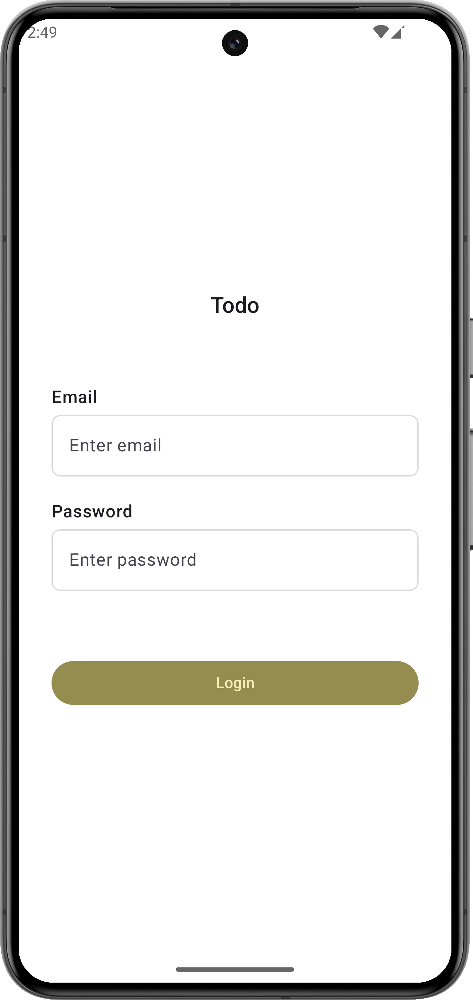
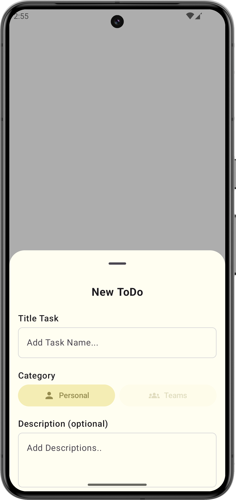
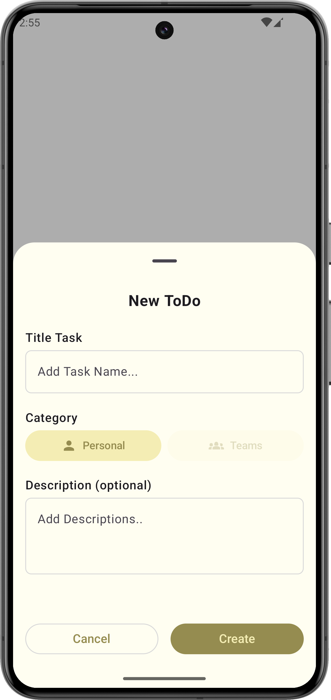
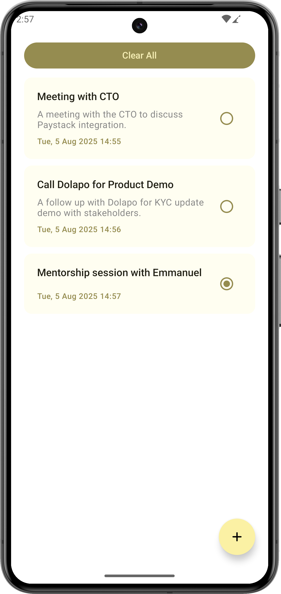

**Compose TODO app**

This is a compose TODO app with a sleak user interface. It leverages MVVM design pattern for data spooling and display.
Quite simple with no complex entities or components. 

